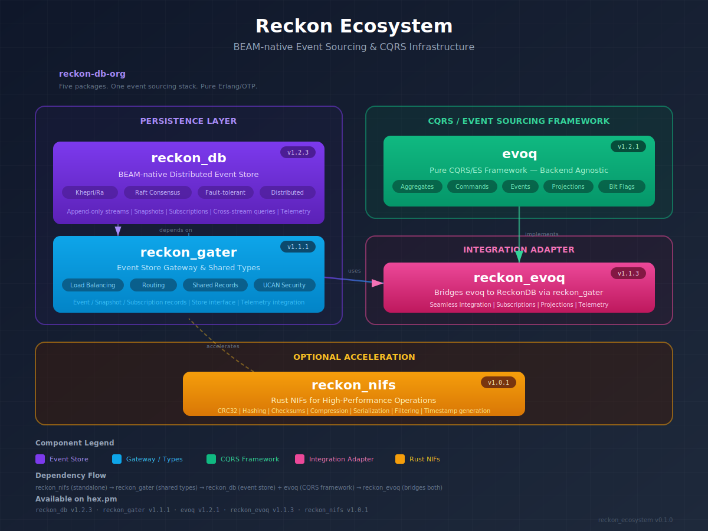
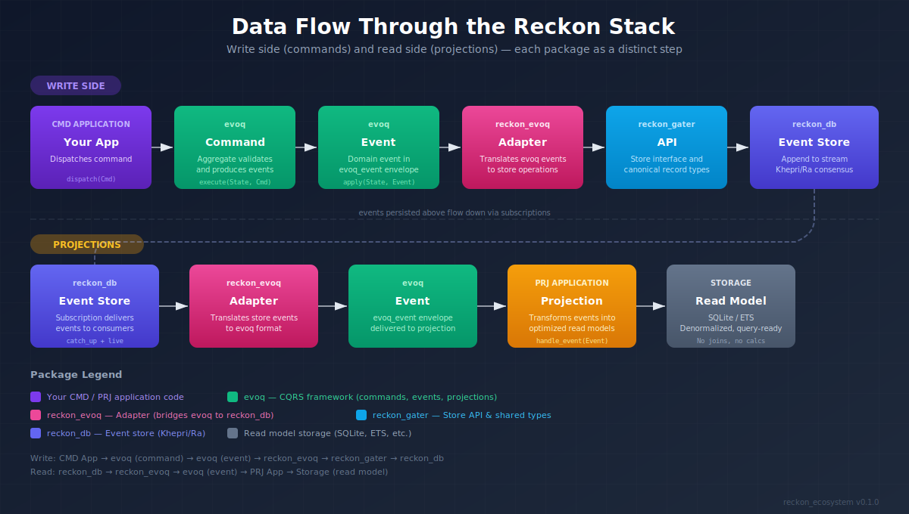
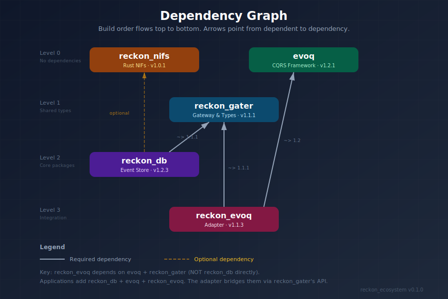

# Reckon Ecosystem

<div align="center">
  

  <h3>BEAM-native Event Sourcing &amp; CQRS Infrastructure</h3>

  <p><em>Five Erlang/OTP packages that give your applications an immutable, distributed event store with a pure CQRS framework.</em></p>

  [](LICENSE)
  [](https://buymeacoffee.com/rlefever)
</div>

---

## What is Reckon?

Reckon is an **event sourcing stack** built entirely in Erlang/OTP. It provides everything you need to build CQRS/ES applications on the BEAM:

- **Durable Event Store** — Append-only streams persisted on Khepri/Ra (Raft consensus)
- **CQRS Framework** — Aggregates, commands, events, projections, process managers
- **Backend-agnostic Design** — The framework (evoq) is separate from storage (reckon_db)
- **Optional Rust Acceleration** — Drop-in NIFs for hot-path performance
- **Seamless Integration** — One adapter package bridges framework and store

No external databases. No message brokers. Pure BEAM.

## Architecture Overview

<p align="center">
  
</p>

## Data Flow

<p align="center">
  
</p>

Commands enter through evoq aggregates, produce domain events, which are persisted to reckon_db via the reckon_evoq adapter. Subscriptions deliver events to projections that build optimized read models.

> See [Architecture](guides/architecture.md) for the full deep-dive.

---

## The Packages

| Package | Version | Description | Links |
|---------|---------|-------------|-------|
| **reckon_db** | 1.2.3 | BEAM-native distributed event store on Khepri/Ra | [GitHub](https://github.com/reckon-db-org/reckon-db) \| [HexDocs](https://hexdocs.pm/reckon_db) |
| **reckon_gater** | 1.1.1 | Event store gateway, shared types, and store interface | [GitHub](https://github.com/reckon-db-org/reckon-gater) \| [HexDocs](https://hexdocs.pm/reckon_gater) |
| **evoq** | 1.2.1 | Pure CQRS/ES framework — aggregates, commands, events, projections | [GitHub](https://github.com/reckon-db-org/evoq) \| [HexDocs](https://hexdocs.pm/evoq) |
| **reckon_nifs** | 1.0.1 | Rust NIFs for high-performance operations (optional) | [GitHub](https://github.com/reckon-db-org/reckon-nifs) |
| **reckon_evoq** | 1.1.3 | Adapter bridging evoq to reckon_db via reckon_gater | [GitHub](https://github.com/reckon-db-org/reckon-evoq) \| [HexDocs](https://hexdocs.pm/reckon_evoq) |

---

### reckon_db — The Event Store

A BEAM-native, distributed event store built on [Khepri](https://github.com/rabbitmq/khepri) and [Ra](https://github.com/rabbitmq/ra) (Raft consensus).

**Core capabilities:**
- **Append-only Streams** — Immutable event log per aggregate instance
- **Raft Consensus** — Strong consistency across distributed nodes
- **Subscriptions** — Catch-up and live event delivery
- **Cross-stream Queries** — Tag-based queries across all streams
- **Snapshots** — Periodic aggregate state snapshots for fast replay
- **Telemetry** — Built-in metrics for monitoring

```erlang
%% Add to rebar.config
{deps, [{reckon_db, "1.2.3"}]}.
```

> See [reckon_db Guide](guides/reckon-db.md)

---

### reckon_gater — Gateway &amp; Shared Types

The shared type definitions and store interface that all packages depend on. Provides the API contract between framework and storage.

**Core capabilities:**
- **Event Records** — Canonical `#reckon_event{}` record used everywhere
- **Snapshot Records** — `#reckon_snapshot{}` for aggregate state caching
- **Subscription Records** — `#reckon_subscription{}` for event delivery
- **Store Interface** — Behaviour defining the event store API
- **Load Balancing** — Request routing and UCAN security

```erlang
{deps, [{reckon_gater, "1.1.1"}]}.
```

> See [reckon_gater Guide](guides/reckon-gater.md)

---

### evoq — CQRS/ES Framework

A pure, backend-agnostic CQRS and Event Sourcing framework. evoq doesn't know about reckon_db — it works with any store via adapters.

**Core capabilities:**
- **Aggregates** — `evoq_aggregate` behaviour with `execute/2` and `apply/2` callbacks
- **Commands** — Type-safe command dispatch with validation
- **Events** — Domain events as maps with versioned types
- **Projections** — `evoq_projection` behaviour for building read models
- **Process Managers** — Cross-aggregate orchestration
- **Bit Flags** — `evoq_bit_flags` for efficient status tracking
- **Subscriptions** — Event delivery with catch-up and live modes

```erlang
{deps, [{evoq, "1.2.1"}]}.
```

> See [evoq Guide](guides/evoq.md)

---

### reckon_nifs — Rust Acceleration

Optional Rust NIFs providing native-speed implementations of performance-critical operations.

**Operations:**
- **CRC32** — Cyclic redundancy checks
- **Hashing** — Fast hash computation
- **Checksums** — Data integrity verification
- **Compression** — Efficient data compression
- **Serialization** — High-speed encoding/decoding
- **Filtering** — Optimized event filtering
- **Timestamps** — Monotonic timestamp generation

```erlang
{deps, [{reckon_nifs, {git, "https://github.com/reckon-db-org/reckon-nifs.git", {branch, "main"}}}]}.
```

> See [reckon_nifs Guide](guides/reckon-nifs.md)

---

### reckon_evoq — The Adapter

Bridges evoq's CQRS framework to reckon_db's event store. This is the glue that connects dispatch to persistence.

**Key design:**
- Depends on `evoq` (framework) and `reckon_gater` (types) — **not** reckon_db directly
- Implements evoq's store interface using reckon_gater's API
- Handles event serialization, subscription management, and telemetry

```erlang
{deps, [{reckon_evoq, "1.1.3"}]}.
```

> See [reckon_evoq Guide](guides/reckon-evoq.md)

---

## Dependency Graph

<p align="center">
  
</p>

### Install Order

For a typical application, add all three core packages:

```erlang
%% rebar.config
{deps, [
    {reckon_db, "1.2.3"},       %% Event store
    {reckon_evoq, "1.1.3"},     %% Adapter (brings evoq as transitive dep)
    %% Optional:
    %% {reckon_nifs, {git, "...", {branch, "main"}}}
]}.
```

The dependency chain:
```
reckon_nifs     (standalone, optional)
reckon_gater    (standalone, shared types)
reckon_db       (depends on reckon_gater)
evoq            (standalone, no reckon deps)
reckon_evoq     (depends on evoq + reckon_gater)
```

---

## Documentation

### Getting Started

- [**Overview**](guides/overview.md) — What Reckon is and why it exists
- [**Getting Started**](guides/getting-started.md) — Install packages and build your first aggregate
- [**Architecture**](guides/architecture.md) — How the packages fit together

### Package Guides

- [**reckon_db**](guides/reckon-db.md) — Event store deep-dive
- [**reckon_gater**](guides/reckon-gater.md) — Gateway and shared types
- [**evoq**](guides/evoq.md) — CQRS/ES framework guide
- [**reckon_nifs**](guides/reckon-nifs.md) — Rust NIF acceleration
- [**reckon_evoq**](guides/reckon-evoq.md) — Integration adapter

---

## Why Reckon?

### Pure BEAM

No external dependencies. No PostgreSQL. No Kafka. No Redis. The entire event sourcing stack runs inside your BEAM VM as Erlang/OTP applications. Start a node, start writing events.

### Distributed by Default

Khepri/Ra provides Raft consensus out of the box. Your event store replicates across nodes automatically. No operational burden of managing separate database clusters.

### Backend-agnostic Framework

evoq is a pure CQRS framework with no storage opinion. Today it connects to reckon_db via reckon_evoq. Tomorrow it could connect to PostgreSQL, EventStoreDB, or anything else — without changing your domain code.

### Battle-tested Foundations

Built on Ra (used in RabbitMQ for queue replication) and Khepri (RabbitMQ's next-generation metadata store). These aren't experiments — they're production infrastructure backing millions of message queues.

---

## Who Uses Reckon?

- [**Hecate**](https://github.com/hecate-social/hecate-ecosystem) — AI-powered developer studio for Macula mesh applications
- [**Macula**](https://github.com/macula-io/macula-ecosystem) — Distributed application platform with HTTP/3 mesh networking

---

## Community

- **GitHub**: [reckon-db-org](https://github.com/reckon-db-org)
- **Hex.pm**: [reckon_db](https://hex.pm/packages/reckon_db) | [evoq](https://hex.pm/packages/evoq) | [reckon_gater](https://hex.pm/packages/reckon_gater) | [reckon_evoq](https://hex.pm/packages/reckon_evoq)

## License

Apache 2.0 — See [LICENSE](LICENSE)

---

<p align="center">
  <sub>Built with Erlang/OTP and Rust. Event sourcing for the BEAM, by the BEAM.</sub>
</p>
