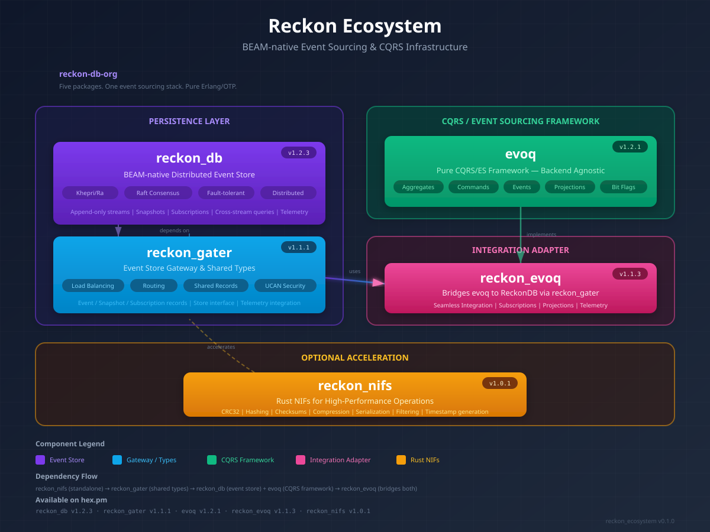
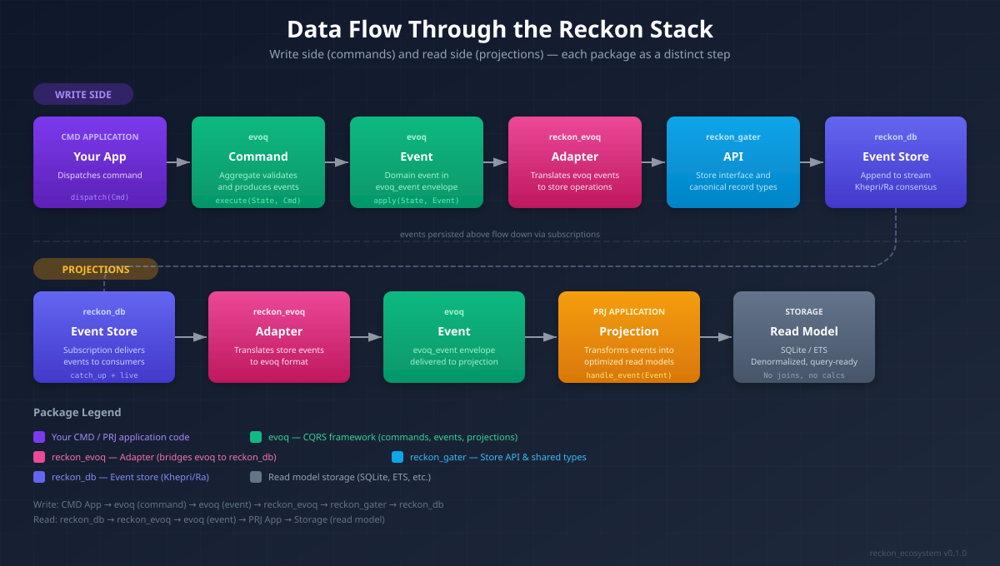
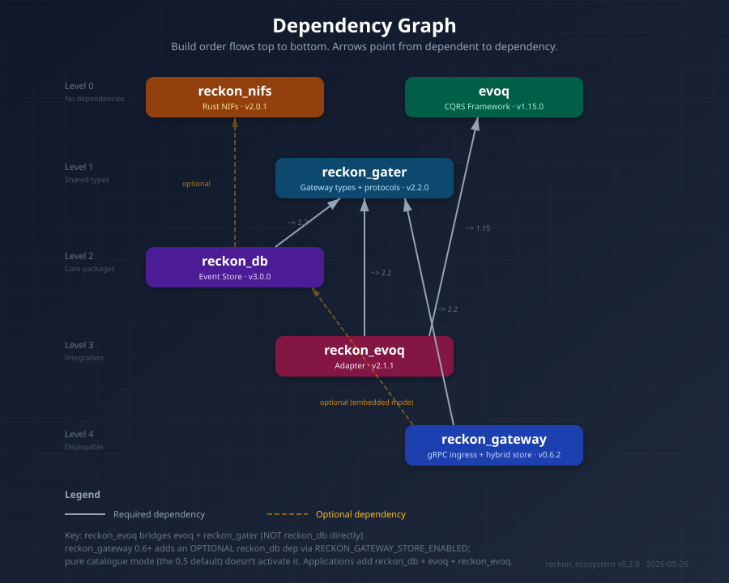

# Reckon Ecosystem

<div align="center">
  <picture>
    <source media="(prefers-color-scheme: dark)" srcset="assets/reckondb-logo-light.svg">
    <source media="(prefers-color-scheme: light)" srcset="assets/reckondb-logo.svg">
    
  </picture>

  <h3>BEAM-native Event Sourcing &amp; CQRS Infrastructure</h3>

  <p><em>Seven Erlang/OTP packages that give your applications an immutable, distributed, self-healing event store with a pure CQRS framework — plus a stable gRPC contract and idiomatic clients for Go, .NET, and Python.</em></p>

  [](LICENSE)
  [](https://buymeacoffee.com/rlefever)
</div>

---

## What is Reckon?

Reckon is an **event sourcing stack** built entirely in Erlang/OTP. It provides everything you need to build CQRS/ES applications on the BEAM — and to consume that store from any language:

- **Durable Event Store** — Append-only streams persisted on Khepri/Ra (Raft consensus)
- **CQRS Framework** — Aggregates, commands, events, projections, process managers, a middleware pipeline
- **Multi-stream Consistency** — Dynamic Consistency Boundary (DCB) conditional appends on tag-filter context queries, and Command Context Consistency (CCC) payload-indexed conditions — uniqueness, allocation, and rate limits without a single-stream lock
- **Self-healing Clusters** — reckon_db continuously audits its own Raft membership and heals a drifted/split replica back into quorum, no operator scripts
- **Backend-agnostic Design** — The framework (evoq) is separate from storage (reckon_db)
- **Optional Rust Acceleration** — Drop-in NIFs for hot-path performance
- **Polyglot Access** — A stable gRPC contract (reckon_proto) fronted by reckon_gateway, with idiomatic Go, .NET, and Python clients

No external databases. No message brokers. Pure BEAM at the core.

## Architecture Overview

<p align="center">
  
</p>

## Data Flow

<p align="center">
  
</p>

Commands enter through evoq aggregates, produce domain events, which are persisted to reckon_db via the reckon_evoq adapter. Subscriptions deliver events to projections that build optimized read models. From outside the BEAM, polyglot clients speak gRPC to reckon_gateway, which fronts one or many stores.

> See [Architecture](guides/architecture.md) for the full deep-dive.

---

## The Packages

### BEAM core (Erlang/OTP)

| Package | Version | Description | Links |
|---------|---------|-------------|-------|
| **reckon_db** | 5.9.0 | BEAM-native distributed event store on Khepri/Ra; DCB + CCC conditional appends, **continuous cluster self-healing**, tamper-evident events + snapshots | [GitHub](https://github.com/reckon-db-org/reckon-db) \| [HexDocs](https://hexdocs.pm/reckon_db) |
| **reckon_gater** | 3.10.0 | Event store gateway, shared types + protocols (event, snapshot, subscription, DCB/CCC `tag_filter`), tamper-resistance primitives | [GitHub](https://github.com/reckon-db-org/reckon-gater) \| [HexDocs](https://hexdocs.pm/reckon_gater) |
| **evoq** | 1.23.0 | Pure CQRS/ES framework; aggregates, projections, process managers, middleware pipeline, and **Decisions (DCB/CCC)** | [GitHub](https://github.com/reckon-db-org/evoq) \| [HexDocs](https://hexdocs.pm/evoq) |
| **reckon_nifs** | 2.0.1 | Rust NIFs for high-performance operations (optional), as layer-qualified crates | [GitHub](https://github.com/reckon-db-org/reckon-nifs) |
| **reckon_evoq** | 2.7.0 | Adapter bridging evoq to reckon_db; propagates chain hash to projections | [GitHub](https://github.com/reckon-db-org/reckon-evoq) \| [HexDocs](https://hexdocs.pm/reckon_evoq) |
| **reckon_gateway** | 0.27.0 | gRPC ingress exposing ReckonDB to polyglot clients; catalogue-mode federation over remote clusters + optional embedded store | [GitHub](https://github.com/reckon-db-org/reckon-gateway) |

### Wire contract + polyglot clients

| Package | Version | Description | Links |
|---------|---------|-------------|-------|
| **reckon_proto** | 0.8.0 | The gRPC `.proto` wire contract (SemVer at the wire level). Single source of truth for every client and the gateway | [GitHub](https://github.com/reckon-db-org/reckon-proto) |
| **reckon-go** | 0.9.0 | Idiomatic Go client over the full gateway surface | [GitHub](https://github.com/reckon-db-org/reckon-go) |
| **reckon-dotnet** | 0.1.0 | Idiomatic .NET client | [GitHub](https://github.com/reckon-db-org/reckon-dotnet) |
| **reckon-py** | 0.1.0 | Python client | [GitHub](https://github.com/reckon-db-org/reckon-py) |
| **reckon-lazy** | 0.4.0 | `lazyreckon` — a terminal UI for browsing stores/streams/events, built on reckon-go | [GitHub](https://github.com/reckon-db-org/reckon-lazy) |

---

### reckon_db — The Event Store

A BEAM-native, distributed event store built on [Khepri](https://github.com/rabbitmq/khepri) and [Ra](https://github.com/rabbitmq/ra) (Raft consensus).

**Core capabilities:**
- **Append-only Streams** — Immutable event log per aggregate instance
- **Raft Consensus** — Strong consistency across distributed nodes
- **Dynamic Consistency Boundary (DCB)** — Conditional append on a tag-filter context query (tag + `event_type` leaves, full boolean algebra), for cross-stream invariants that no single stream version can guard
- **Command Context Consistency (CCC)** — Payload-indexed conditional append and reads via `{payload, Key}` / `{payload_hash, [Keys]}` index declarations with `{payload_match, ...}` filters
- **Continuous Self-healing** — A per-store healer audits Raft membership and heals a drifted/split/isolated replica back into quorum, with drift/heal telemetry; the coordinator is wedge-proof (bounded liveness probes)
- **Subscriptions** — Catch-up and live delivery (stream, event type, pattern, payload matching)
- **Snapshots** — Periodic aggregate state snapshots for fast replay
- **Tamper-evidence** — Optional per-store HMAC-chained events and snapshots, verified on every read surface

```erlang
%% Add to rebar.config
{deps, [{reckon_db, "~> 5.9"}]}.
```

> See [reckon_db Guide](guides/reckon-db.md)

---

### reckon_gater — Gateway &amp; Shared Types

The shared type definitions and store interface that the BEAM packages depend on. Provides the API contract between framework and storage.

**Core capabilities:**
- **Event Records** — Canonical `#reckon_event{}` record used everywhere
- **Snapshot Records** — `#reckon_snapshot{}` for aggregate state caching
- **Subscription Records** — `#reckon_subscription{}` for event delivery
- **DCB/CCC types** — `tag_filter` context queries and payload-condition declarations
- **Store Interface** — Behaviour defining the event store API
- **Load Balancing** — Request routing and UCAN security

```erlang
{deps, [{reckon_gater, "~> 3.10"}]}.
```

> See [reckon_gater Guide](guides/reckon-gater.md)

---

### evoq — CQRS/ES Framework

A pure, backend-agnostic CQRS and Event Sourcing framework. evoq doesn't know about reckon_db — it works with any store via adapters. (The CCC payload-condition features require a store that provides payload indexes; reckon_db does.)

**Core capabilities:**
- **Aggregates** — `evoq_aggregate` behaviour with `execute/2` and `apply/2` callbacks
- **Commands** — Type-safe command dispatch with validation and a middleware pipeline
- **Events** — Domain events as maps with versioned types
- **Projections** — `evoq_projection` behaviour for building read models
- **Process Managers** — Cross-aggregate orchestration
- **Decisions (DCB/CCC)** — `evoq_decision` behaviour for cross-cutting consistency boundaries (uniqueness, allocation, rate limits) that lock on the *absence* of events matching a tag-filter, and can scope that boundary on payload fields (CCC)
- **Bit Flags** — `evoq_bit_flags` for efficient status tracking

```erlang
{deps, [{evoq, "~> 1.23"}]}.
```

> See [evoq Guide](guides/evoq.md)

---

### reckon_nifs — Rust Acceleration

Optional Rust NIFs providing native-speed implementations of performance-critical operations. Organised as layer-qualified crates targeting either `reckon-db` or `reckon-gater`.

**NIF crates:**
- **`reckon_db_hash_nif`** — xxHash / FNV-1a for partitioning and routing
- **`reckon_db_crypto_nif`** — Ed25519 verify, SHA-256, secure compare (capability verification)
- **`reckon_db_archive_nif`** — LZ4 / Zstd compression for archive files
- **`reckon_db_aggregate_nif`** — Vectorised event aggregation
- **`reckon_db_filter_nif`** — Regex / pattern matching against event streams
- **`reckon_db_graph_nif`** — Graph algorithms (petgraph) for causation / lineage queries
- **`reckon_gater_crypto_nif`** — Base58 encode / decode, UCAN resource pattern matching

```erlang
{deps, [{reckon_nifs, {git, "https://github.com/reckon-db-org/reckon-nifs.git", {branch, "main"}}}]}.
```

> See [reckon_nifs Guide](guides/reckon-nifs.md)

---

### reckon_evoq — The Adapter

Bridges evoq's CQRS framework to reckon_db's event store. This is the glue that connects dispatch to persistence.

**Key design:**
- Depends on `evoq` (framework) and `reckon_gater` (types) — **not** reckon_db directly
- Implements evoq's store interface using reckon_gater's API
- Handles event serialization, subscription management, DCB/CCC condition translation, and telemetry

```erlang
{deps, [{reckon_evoq, "~> 2.7"}]}.
```

> See [reckon_evoq Guide](guides/reckon-evoq.md)

---

### reckon_gateway — gRPC Ingress

A gRPC façade for ReckonDB. Lets Go, .NET, Python, or any gRPC-capable language consume the event store from outside the BEAM. It serves the `reckon_proto` contract and runs in two modes:

- **Catalogue mode (default)** — federates one or many remote reckon_db clusters over Erlang distribution; the gateway hosts no stores itself.
- **Embedded mode** — boots a local store (`RECKON_GATEWAY_STORE_ENABLED=true`).

**Services exposed** (see [reckon_proto](guides/reckon-proto.md)):
- `StreamService` — Append, read (forward/backward/streaming), list, delete; read by event type / tags / metadata / global
- `SubscriptionService` — Persistent subscriptions (server-streaming)
- `SnapshotService` — Aggregate state snapshots
- `DcbService` — DCB conditional appends + CCC payload-indexed reads (`CccReadByPayload`, `CccReadByPayloadHash`)
- `TemporalService` — Time-based / time-travel reads (`ReadUntil`, `ReadRange`, `VersionAt`)
- `SchemaService` — Event schema registration and upcasting
- `AdminService` — Store inspection, scavenging, projection/stream links, catalogue reload
- `StoresService` — Cluster topology discovery + watch
- `HealthService` — Health checks, cluster consistency / membership consensus / Raft log verification, memory pressure, server info

```bash
docker run -p 50051:50051 -v reckon-data:/app/data reckon-gateway
```

> See [reckon_gateway Guide](guides/reckon-gateway.md)

---

## Polyglot Clients

Every client generates its stubs from the **reckon_proto** contract at build time and connects to a running gateway over gRPC at runtime. The contract is versioned with SemVer at the wire level, so a client and gateway on the same minor line interoperate.

- **[reckon_proto](guides/reckon-proto.md)** — the `.proto` files. Consumed by the gateway (server stubs) and every client (client stubs; reckon-py vendors the protos, reckon-dotnet pins them as a git submodule).
- **[reckon-go](https://github.com/reckon-db-org/reckon-go)** — `reckon.Connect(ctx, "gateway:50051")`; per-service sub-clients (`Stores`, `Streams`, `Subscriptions`, `Snapshots`, `Dcb`, `Schema`, `Temporal`, `Admin`, `Health`).
- **[reckon-dotnet](https://github.com/reckon-db-org/reckon-dotnet)** — `await ReckonClient.ConnectAsync("gateway:50051")`.
- **[reckon-py](https://github.com/reckon-db-org/reckon-py)** — Python client for scripting and data workflows.
- **[reckon-lazy](https://github.com/reckon-db-org/reckon-lazy)** — `lazyreckon`, a terminal UI for browsing stores/streams/events, built on reckon-go.

> See [Polyglot Clients](guides/polyglot-clients.md) and [DCB &amp; CCC](guides/dcb-and-ccc.md).

---

## Dependency Graph

<p align="center">
  
</p>

### Install Order

For a typical BEAM application, add the core packages:

```erlang
%% rebar.config
{deps, [
    {reckon_db, "~> 5.9"},      %% Event store
    {reckon_evoq, "~> 2.7"},    %% Adapter (brings evoq as transitive dep)
    %% Optional:
    %% {reckon_nifs, {git, "...", {branch, "main"}}}
]}.
```

The dependency chain:
```
reckon_nifs       (standalone, optional)
reckon_gater      (standalone, shared types + DCB/CCC)
reckon_db         (depends on reckon_gater; optional reckon_nifs)
evoq              (standalone, no reckon deps)
reckon_evoq       (depends on evoq + reckon_gater)
reckon_gateway    (depends on reckon_gater + reckon_proto; optional embedded reckon_db)
reckon_proto      (standalone wire contract)
reckon-go/-dotnet/-py  (generate stubs from reckon_proto; connect to gateway over gRPC)
reckon-lazy       (built on reckon-go)
```

> Use loose constraints (`~> X.Y`). Exact pins block coordinated updates across the diamond (reckon_evoq consumes both evoq and reckon_gater).

---

## Documentation

### Getting Started

- [**Overview**](guides/overview.md) — What Reckon is and why it exists
- [**Getting Started**](guides/getting-started.md) — Install packages and build your first aggregate
- [**Architecture**](guides/architecture.md) — How the packages fit together

### Package Guides

- [**reckon_db**](guides/reckon-db.md) — Event store deep-dive
- [**reckon_gater**](guides/reckon-gater.md) — Gateway and shared types
- [**evoq**](guides/evoq.md) — CQRS/ES framework guide
- [**reckon_nifs**](guides/reckon-nifs.md) — Rust NIF acceleration
- [**reckon_evoq**](guides/reckon-evoq.md) — Integration adapter
- [**reckon_gateway**](guides/reckon-gateway.md) — gRPC façade for polyglot clients

### Contract, Clients &amp; Concepts

- [**reckon_proto**](guides/reckon-proto.md) — The gRPC wire contract
- [**Polyglot Clients**](guides/polyglot-clients.md) — Go, .NET, Python, and the lazyreckon TUI
- [**DCB &amp; CCC**](guides/dcb-and-ccc.md) — Multi-stream consistency without a single-stream lock

---

## Why Reckon?

### Pure BEAM at the core

No external dependencies. No PostgreSQL. No Kafka. No Redis. The entire event sourcing core runs inside your BEAM VM as Erlang/OTP applications. Start a node, start writing events.

### Distributed and self-healing by default

Khepri/Ra provides Raft consensus out of the box, and reckon_db 5.8+ adds continuous self-healing: a drifted or split replica is detected and rejoined to its quorum without operator scripts. Your event store replicates across nodes and keeps itself whole.

### Consistency beyond a single stream

DCB and CCC let a command enforce invariants that span many streams — uniqueness, allocation, rate limits — by conditioning the append on the *absence* of matching events, rather than optimistic-locking one stream's version.

### Backend-agnostic framework

evoq is a pure CQRS framework with no storage opinion. Today it connects to reckon_db via reckon_evoq. Tomorrow it could connect to something else — without changing your domain code.

### Any language, one contract

reckon_proto is the single wire contract. The gateway serves it; Go, .NET, and Python clients generate from it. Consume the store from outside the BEAM without speaking Erlang distribution.

### Battle-tested foundations

Built on Ra (RabbitMQ's queue-replication library) and Khepri (RabbitMQ's next-generation metadata store) — production infrastructure backing millions of message queues.

---

## Who Uses Reckon?

- [**Hecate**](https://github.com/hecate-social/hecate-ecosystem) — AI-powered developer studio for Macula mesh applications
- [**Macula**](https://github.com/macula-io/macula-ecosystem) — Distributed application platform with HTTP/3 mesh networking

---

## Community

- **GitHub**: [reckon-db-org](https://github.com/reckon-db-org) (canonical)
- **GitHub mirror**: [reckon-db-org](https://github.com/reckon-db-org) (read-only)
- **Hex.pm**: [reckon_db](https://hex.pm/packages/reckon_db) | [evoq](https://hex.pm/packages/evoq) | [reckon_gater](https://hex.pm/packages/reckon_gater) | [reckon_evoq](https://hex.pm/packages/reckon_evoq)

## License

Apache 2.0 — See [LICENSE](LICENSE)

---

<p align="center">
  <sub>Built with Erlang/OTP and Rust. Event sourcing for the BEAM, by the BEAM — consumable from anywhere.</sub>
</p>
